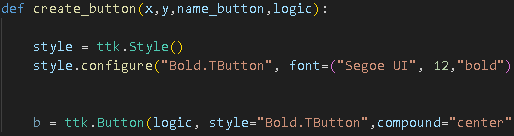
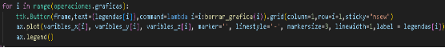
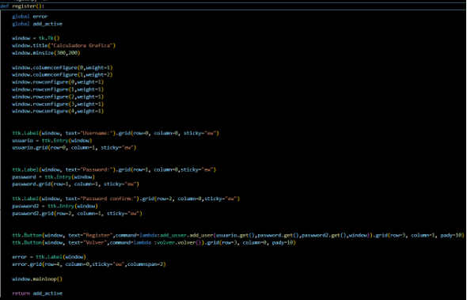
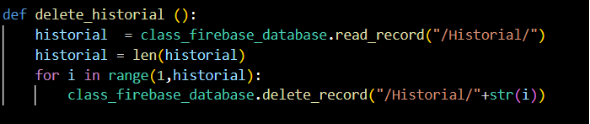
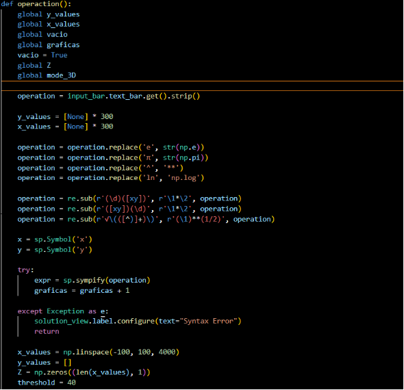
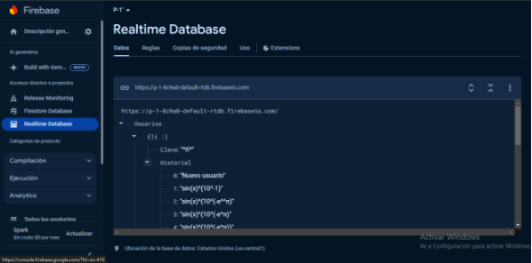
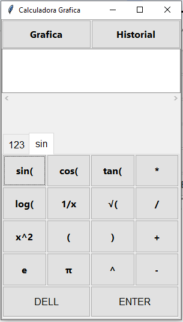

**Manual técnico**

**Calculadora gráfica**

**PRESENTADO POR:**

HECTOR MILLER PATIÑO

SANTIAGO BARBOSA

MAYCOL FIGUEROA

MIGUEL TOVAR

**MATERIA:**

Programación de computadores

**PROFESOR:**

Nestor German Bolivar Pulgarin

**UNIVERSIDAD NACIONAL DE COLOMBIA**

**FACULTAD DE INGENIERÍA- ELECTRÓNICA**

**BOGOTA 2024**

**Contenido**

[**1. Objetivos	2**](#_wzuuwjnbjomg)**

[**2. Alcance	2**](#_eo5r2n2bzbo)

[**3. Requerimientos Técnicos Software y Hardware	2**](#_p8tomfddk5g2)

[**4. Herramientas Utilizadas para el Desarrollo	2**](#_dlvt4ubawk0x)

[**5. Instalación	3**](#_fu5qce4wr0zm)

[**5.1. Clonar el repositorio	3**](#_wtx2995zx3t3)

[**5.2. Ejecutar el archivo principal	3**](#_nf2d5b3sunxa)

[**6. Configuración	4**](#_pn6uvsymqh9l)

[**7. Análisis de código	4**](#_segjckbl2v5z)

[**7.1. Introducción	48**](#_jcd99pq2jzre)

[**7.1.1. Propósito	48**](#_nz9o7k1v2nop)

[**7.1.2. Alcance	48**](#_bj9i9hfu6w64)

[**7.1.3. Personal Involucrado	49**](#_41gdbucrcwes)

[**7.1.4. Resumen	50**](#_ijia1ywciw67)

[**7.2. Descripción general	50**](#_vpk2y75jyy9i)

[**7.2.1. Perspectiva del producto	50**](#_c8aiqkibru5h)

[**7.2.2. Funcionalidad del producto	50**](#_2tgx1rrt4mgg)

[7.2.3. Características de los usuarios	50](#_knhgt4trup3k)

[7.2.4. Restricciones	51](#_tl2eepyfjmpc)

[**8. Diseño de la arquitectura	52**](#_nsppaj8lv9mr)

[8.1. Diagramas de casos de uso	52](#_5sfana5lpq0u)

[8.2. Casos de Uso	52](#_vvued0u27by)

[8.3. Diagramas de Estado	54](#_loanqzz4lt1z)

[8.4. Diagramas de Secuencia	55](#_q285n5ys6kzy)

[**9. Tecnologías Asociadas	56**](#_q4nsde3se8u4)

[**10. Prototipo entregado	57**](#_y8hsqz7vtts9)

[**11. Conclusiones	62**](#_2yr7ui5hdazh)

1. # Objetivos
- El objetivo de este manual es explicar el funcionamiento de la calculadora gráfica de funciones, todo su código, su forma de uso y dar un breve recorrido sobre todo el proceso de creación del proyecto.
1. # Alcance
- El siguiente documento va dirigido a programadores, con conocimientos básicos de programación en python, programación orientada a objetos y bases de datos.
1. # Requerimientos Técnicos Software y Hardware
- Antes de instalar y utilizar la aplicación, asegúrate de que tu sistema cumpla con los siguientes requisitos:
- Sistema Operativo: Windows, macOS, Linux
- Versión de Python: Python 3 en adelante
- Librerías necesarias:
  - **“tkinter”** para la interfaz gráfica.
  - **“matplotlib”** para graficar funciones en 2D.
  - **“numpy”** para cálculos matemáticos avanzados.
  - **“sympy”** para manipulación simbólica.
  - **“mpl\_toolkits.mplot3d”** para graficar funciones en 3D.
  - **“firebase-admin”** para la integración con Firebase.

Se pueden instalar estas bibliotecas utilizando el siguiente comando en la consola cmd:

- pip install (nombre de las librerías mencionadas en el ítem anterior)

`	`Ejemplo:

***Figura 1***
1. # Herramientas Utilizadas para el Desarrollo
- Visual Studio Code para la implementación del código
- Gestor de bases de datos: Firebase para la administración de los datos almacenados.
1. # Instalación
   1. ## Clonar el repositorio
- Ir al repositorio de github en el siguiente link: <https://github.com/Mike-arch-code/Calculadora> 
- Dar click en el botón verde “<> Code” y seleccionar “Download ZIP”

  
  ***Figura 2***

- Dirigirse a la ubicación donde se descargó el archivo y descomprimir la carpeta.
  1. ## Ejecutar el archivo principal
- Una vez que las dependencias estén instaladas, puedes ejecutar la aplicación abriendo Visual Studio Code y seleccionar la carpeta descomprimida, luego seleccionar el archivo main.py y ejecutarlo en la consola.***Figura 3***
1. # Configuración
- No existe una configuración general; la aplicación está preconfigurada y los comandos están diseñados de manera intuitiva para que tanto usuarios como programadores puedan manejar el sistema con facilidad.
1. # Análisis de código
- **Archivo para ejecutar: “Main”**

  

  ***Figura 4***

  Aquí se importa el archivo “controller” y se hace el llamado de la función “controller\_aplication” dentro de la función “main”, es clave puesto que se encarga de ejecutar la aplicación y abrir “Window log”.**(Figura 4)**

- **Paquete: “control” (Inicio de sesión)**
  - **Controller**

***Figura 5***

**Import:**

Aquí se importan varios módulos esenciales para la aplicación desde los módulos **“interface”** y **“data\_base”**:

- **“main\_window”:** Para la ventana principal.
- **“class\_firebase\_database”**: Para inicializar la base de datos.
- **“window\_log”**: Para la pantalla de Inicio de Sesión, Registro o Modo Offline.
- **“login”**: Para mostrar la ventana de inicio de sesión y hacer el proceso de autenticación de usuario en la base de datos.
- **“register”**: Para el registro de nuevos usuarios en la base de datos.

  Previo a la creación de la función “controller\_aplication” se nombra la variable “base\_active” igual a False, ya que se está indicando que la base de datos no está inicializada.**(Figura 5)** 

**Funciones:**

- **controller\_aplication:**

  

  ***Figura 6***

  Aquí se define la función principal “controller\_aplication()”.  Se inicializa la variable global “offoline” en False, indicando que la aplicación está en línea por defecto y se nombra la variable “base\_active” como global.**(Figura 6)**

  

  ***Figura 7***

  La variable opción llama a la función “log” del archivo “window\_log” que se encuentra en el módulo “Interface” y se captura la opción seleccionada por el usuario (1: Iniciar sesión, 2: Registrarse, 3: Modo offline).**(Figura 7)**

  

  ***Figura 8***

  Aquí se maneja la opción de iniciar sesión. Si el usuario selecciona la opción 1, se inicializa la base de datos y se autentica el nombre de usuario y contraseña. Si la autenticación es exitosa, se crea la ventana principal.**(Figura 8)**

  

  ***Figura 9***

  Esta es la opción de registrarse. Si el usuario selecciona la opción 2, se inicializa la base de datos, se marca “offoline” como False y se procede al registro de un nuevo usuario. Si el registro es exitoso, se intenta autenticar al usuario y, de ser exitoso, se crea la ventana principal.**(Figura 9)**

  

  ***Figura 10***

  Esta es la opción de modo sin conexión. Si el usuario elige la opción 3, la variable offoline se establece en True, indicando que la aplicación está en ese modo, y se muestra la ventana principal sin conexión a la base de datos.**(Figura 10)**

- **Paquete: “data\_base” (Historial)**
  - **class\_firebase\_database**

    

`		`***Figura 11***

**Import:**

Aquí se importan los módulos necesarios para trabajar con Firebase en Python: 

- **“firebase\_admin”**: Es el SDK de Firebase para administrar aplicaciones backend.
- **“credentials”** y **“db”**: Son componentes específicos para la autenticación y el manejo de la base de datos.**(Figura 11)**

**Funciones:**

- **init:**

***Figura 12***

Aquí se define la función “init()” que inicializa la aplicación de Firebase. Se cargan las credenciales desde un archivo JSON (ubicado en key\\credenciales.json) y se inicializa la aplicación con la URL de la base de datos en tiempo real de Firebase.**(Figura 12)**

***Figura 13***

Aquí se define la función “write\_record()” que escribe datos en una ruta específica de la base de datos. Se crea una referencia a la ruta dada (path) y luego se utiliza el método “set()” para almacenar los datos proporcionados en (data).**(Figura 13)**

***Figura 14***

Aquí se define la función “read\_record()” que lee y retorna los datos de una ruta específica en la base de datos. Se crea una referencia a la ruta dada (path) y se utiliza el método “get()” para obtener los datos almacenados en esa ubicación.**(Figura 14)**

***Figura 15***

Aquí se define la función “update\_record()” que actualiza datos en una ruta específica de la base de datos. Se crea una referencia a la ruta dada (path) y se utiliza el método “update()” para modificar los datos existentes con los nuevos valores proporcionados (data).**(Figura 15)**

***Figura 16***

Aquí se define la función “delete\_record()” que elimina los datos en una ruta específica de la base de datos. Se crea una referencia a la ruta dada (path) y se utiliza el método “delete()” para remover los datos almacenados en esa ubicación.**(Figura 16)**

- **Paquete: “Interface”**
  - **basic\_butons**

    

    ***Figura 17***

    **Import:**

    Para este archivo se importan:

- **“TclError”**: Es una excepción que se lanza cuando hay un error con tkinter
- **“ttk”**: Es un submódulo de tkinter que agrega widgets avanzados para dar atributos.
- **“crete\_button”**: Se importa desde este mismo módulo para crear botones personalizados.**(Figura 17)**

**Funciones:**

- **basic**

  ![ref1]

  **Figura 18**

  En esta función, se solicita como parámetro la variable “container”, que actuará como el contenedor principal. Dentro de este contenedor, se crea un “frame”, el cual servirá como el espacio donde se generarán los botones de la calculadora. La variable “style” se encarga de definir el estilo visual de los botones, como la fuente y el tamaño del texto.**(Figura 18)**

  ![ref2]

  ***Figura 19***

  Posteriormente se configuran las filas y las columnas del frame creado a través del método “frame.columnconfigure” y “frame.rowconfigure”, distribuyendolas en 4 columnas y 6 filas que dentro de sus atributos tienen un peso (weight) igual a 1, lo que permite que todos los botones se distribuyan uniformemente.**(Figura 19)**

  ![ref3]

  ***Figura 20***

  Después de configurar los botones, se abre el archivo “keyboard\_butons.txt”, ubicado en la carpeta “assets”, y se lee línea por línea su contenido. Cada línea se convierte en una lista, eliminando las tabulaciones, y se almacena en la variable “data”, creando así una matriz con los caracteres de cada botón. Luego, mediante un bucle for anidado, se recorre esta matriz para asignar cada elemento a un botón independiente. Finalmente, se crean dos botones adicionales que realizan acciones especiales a través de las funciones “create\_button\_DELL” y “create\_button\_ANS”, importadas del módulo crete\_button. Finalmente se retorna el frame con todos los botones configurados para ser agregados.**(Figura 20)**

- **central\_frame**

  

  ***Figura 21***

  **Import:**

  Para este módulo se importa:

- **“tkinter”**: Para la creación de elementos de interfaz gráfica.
- **“expand\_buttons”**: Para añadir dos espacios más a la ventana principal por medio de dos botones.
- **“TclError”**:Para lanzar excepciones cuando hay un error con tkinter.
- **“ttk”**:Es un submódulo de tkinter que agrega widgets avanzados para dar atributos.
- **“input\_bar”**: Crea una barra de entrada de texto.
- **“keyboard”**: Crea los espacios donde se encuentran los símbolos básicos y trigonométricos.
- **“solution\_view”**: Crea un espacio en la ventana principal donde se muestran los resultados de las operaciones escritas.**(Figura 21)**

`		`**Funciones:**

- **frame\_central**

***Figura 22***

En esta función “frame\_central()” se crea un marco central en una GUI con una disposición de rejilla específica. Dentro de este marco, coloca varios componentes importantes, como botones de historial y gráfica que expanden la pantalla, una barra de entrada de texto, un marco para mostrar las soluciones de las operaciones y un teclado virtual. Cada componente se coloca en una fila diferente y se configura para que se expanda y llene el espacio disponible de manera proporcional a través de los pesos en los atributos. Finalmente, la función devuelve el marco completo.**(Figura 22)**

- **crete\_button**

  

  ***Figura  23***

  **Import:**

  Para este módulo se importa:

- **“TclError”**: Para lanzar excepciones cuando hay un error con tkinter.
- **“ttk”**:  Agrega widgets avanzados para dar atributos.
- **“input\_bar”**: Módulo que crea el espacio donde se introduce la barra de entrada de texto.
- **“input\_bar\_functions”**: Módulo del paquete “model” que contiene funciones para manipular la barra de entrada de texto.
- **“controller”**:Módulo del paquete “control” que establece el modo de funcionamiento de la calculadora.**(Figura 23)**

`		`**Funciones:**

- **create\_button**

  

  ***Figura 24 (Parte 1)***

  Esta función crea un botón y define su estilo, como la fuente, la tipografía, y el tamaño del texto.**(Figura 24)**

  

  ***Figura 25 (Parte 2)***

  Posteriormente, mediante una función “lambda”, se define el comportamiento del botón, es decir, qué texto o acción se enviará a la barra de entrada de texto al hacer clic en él.**(Figura 25)**

  

  ***Figura 26 (Parte 3)***

  Finalmente, con el método “.grid()”, se define la posición del botón en la cuadrícula de la interfaz gráfica, distribuyéndolo en las columnas y filas correspondientes.**(Figura 26)**

- **create\_button\_DELL:**

  

  ***Figura 27 (Parte 1)***

  Esta función se utiliza para crear un botón de borrado de texto y se establece su estilo, como la fuente, la tipografía, y el tamaño del texto.**(Figura 27)**

  

  ***Figura 28 (Parte 2)***

  Por medio de una función “lambda” se establece el comportamiento del botón, el cual es borrar carácter por carácter lo que aparece en la barra de texto.**(Figura 28)**

  

  ***Figura 29 (Parte 3)***

  Se establece la posición del botón en la cuadrícula, ocupando 2 columnas.**(Figura 29)**

- **create\_button\_ANS**

  

  ***Figura 30 (Parte 1)***

  Esta función se utiliza para crear un botón que calcula y muestra el resultado de la operación dada. En esta parte, se define su estilo, incluyendo la fuente, la tipografía y el tamaño del texto.**(Figura 30)**

  

  ***Figura 31 (Parte 2)***

  A través de una función “lambda” se establece el comportamiento del botón, el cual es realizar todo el cálculo de la operación matemática ingresada en la barra de texto.**(Figura 31)**

  

  ***Figura 32 (Parte 3)***

  Se establece la posición del botón en la cuadrícula, ocupando 2 columnas.**(Figura 32)**

- **expand\_buttons**

  

  ***Figura 33***

  **Import:**

  Para este módulo  se importa:

- **“TclError”**: Para lanzar excepciones cuando hay un error con tkinter.
- **“ttk”**: Agrega widgets avanzados para dar atributos.
- **“size\_window”**: Para modificar el tamaño de la ventana principal.**(Figura 33)**

**Funciones:**

- **expand\_buttons**

  

  ***Figura 34***

  Esta función se encarga de crear los botones de Gráfica e Historial los cuales modifican el tamaño de la pantalla, en primer lugar se establece la tipografía, tamaño y disposición en la cuadrícula.**(Figura 34)**

  

  ***Figura 35***

  Por último se establece el estilo, texto y función de los botones por medio de una función “lambda” que llama a sus módulos respectivos, finalmente se retorna el frame con los botones configurados.**(Figura 35)**

- **grafic\_frame**

  

  ***Figura 36***

  **Import:**

  En este módulo se importa:

- **“tkinter”** y **“ttk”**: Son utilizados para crear la interfaz gráfica, donde se dibujarán los gráficos.
- **“matplotlib.pyplot”**: Se utiliza para crear y manipular gráficos.
- **“FigureCanvasTkAgg”** y **“NavigationToolbar2Tk”**: Son integraciones de Matplotlib con Tkinter, que permiten mostrar gráficos directamente en la interfaz y agregar una barra de herramientas interactiva.
- **“input\_bar”** y **“operaciones”**: Son módulos que contienen elementos como la barra de entrada de texto y funciones para realizar operaciones matemáticas.**(Figura 36)**

`		`**Funciones:**

- **grafic**

  

  ***Figura 37***

  Esta función crea un Frame dentro de un contenedor y lo retorna. Este marco será el espacio donde se dibujarán los gráficos y se colocarán los botones relacionados.**(Figura 37)**

- **actualice\_grafic**

  

  ***Figura 38***

  La función “actualice\_grafic” actualiza y dibuja gráficos en 2D o 3D en la interfaz gráfica. Primero almacena las coordenadas X, Y, y Z junto con sus leyendas, eliminando los gráficos más antiguos si hay más de 10.**(Figura 38)**

- **dibujo**

  

  ***Figura 39***

  Esta es una función anidada dentro de “actualice\_grafic”. Es la responsable de dibujar el gráfico y se ejecuta inmediatamente después de actualizar las listas de variables, si el modo 3D está activado “operaciones.mode\_3D”, se genera un gráfico tridimensional con los ejes X, Y y Z. Se configura el gráfico con límites para los tres ejes y se traza cada gráfico en sus respectivas coordenadas, además el gráfico se dibuja en un “FigureCanvasTkAgg”, que se coloca en la interfaz de Tkinter. Luego, se añade una barra de herramientas interactiva (con zoom, guardar imagen, etc.) a través de “NavigationToolbar2Tk”.**(Figura 39)**

  

  ***Figura 40***

  Finalmente se realiza un bucle for para generar un botón que corresponde a la leyenda de cada gráfico. Estos botones permiten borrar gráficos específicos.**(Figura 40)**

  

  ***Figura 41***

  Si el modo 3D está desactivado, se realiza el mismo proceso para realizar la gráfica de la operación, solo  que en este caso se utilizan variables X y Y a las cuales se les establece un límite, además de crear los botones para borrar las funciones de la gráfica por medio del ciclo for.**(Figura 41)**

- **borrar\_grafica**

  

  ***Figura 42***
  Esta es otra función dentro de “actualice\_grafic” que sirve para eliminar un gráfico específico cuando el usuario hace clic en el botón correspondiente. Se eliminan los valores de las listas y se vuelve a dibujar el gráfico.**(Figura 42)**

- **historial\_frame**

  

  ***Figura 43***

  **Import:**

  Para esta librería se debe importar:

- **“tkinter”** y **“ttk”**: Son utilizados para crear la interfaz gráfica, donde se dibujarán los gráficos.
- **“class\_firebase\_database”**: Para inicializar la base de datos.
- **“clear\_historial”**: Este módulo parece manejar la lógica para borrar registros del historial.
- **“input\_bar\_functions”**:Módulo del paquete “model” que contiene funciones para manipular la barra de entrada de texto.
- **“login”**: Para mostrar la ventana de inicio de sesión y hacer el proceso de autenticación de usuario en la base de datos.
- **“internet”**: Este módulo maneja problemas relacionados con la conexión a Internet.**(Figura 43)**

`		`**Funciones:**

- **historial**

  

  ***Figura 44***

  Esta función se encarga de crear y mostrar la interfaz de usuario para gestionar el historial de operaciones de un usuario en la calculadora. En primer lugar se crea el Frame donde se mostrará la interfaz, se establece el estilo y disposición para luego evaluar si en la base de datos en la ruta donde se encuentran las operaciones guardadas, existe algún elemento, si no lo hay se imprime en la pantalla “No hay historial”.**(Figura 44)**

  

  ***Figura 45***

  Si el historial tiene elementos en su interior, se toma la longitud de la lista y por medio de un ciclo for, se crean 2 botones en una fila, que contienen la operación escrita en la barra de texto y la opción de borrar dicho ítem.**(*Figura 45)***

  

  ***Figura 46***

  Finalmente se retorna la ventana de la calculadora con el nuevo frame creado y al estar dentro de una excepción, si el programa llega a arrojar un error por no poder conectarse a la base de datos, ejecuta la función “internet” del módulo “internet”.**(Figura 46)**

- **actualice\_historial**

  

  ***Figura 47***

  Esta función se utiliza para actualizar la interfaz de usuario para reflejar los cambios en el historial de operaciones del usuario, en primer lugar se establece que el historial debe mostrar sus ítems, se configuran las columnas en el marco para que se distribuyan uniformemente, luego por medio de un ciclo for, se eliminan todos los widgets hijos del marco “window” usando “winfo\_children()”. Esto borra cualquier contenido anterior del historial para que se pueda redibujar la interfaz con los datos actualizados, luego se hace la lectura de los ítems que hay en el historial y se toma su longitud para que finalmente por medio de otro bucle for se vuelvan a crear los dos botones con su contenido actualizado.

  Como último paso si hay un error durante este proceso, se gestiona el error por medio de las función “internet”.**(Figura 47)**

- **history\_offline**

  

  ***Figura 48***

  **Import:**

- **“tkinter”**: Librería estándar de Python para crear interfaces gráficas (GUIs).
- **“ttk”**: Submódulo de Tkinter que proporciona widgets avanzados para mejorar la apariencia gráfica.
- **“clear\_historial”**: Módulo para gestionar la eliminación de elementos en el historial.
- **“input\_bar\_fuctions”**: Módulo que maneja las funciones relacionadas con la barra de entrada de texto.
- **“save”**: Módulo para gestionar el guardado del historial tanto en línea como offline.**(Figura 48)**

`		`**Funciones:**

- **historial**

  

`	`***Figura 49***

Esta función configura una interfaz gráfica para mostrar el historial de operaciones. Crea un marco “window” dentro del contenedor proporcionado y configura el estilo de los botones. Lee el historial desde un archivo de texto “historial.txt”, creando una lista de ítems. Si hay elementos en el historial, se crean botones para cada ítem y un botón de eliminación correspondiente. Si el archivo no existe o está vacío, muestra un mensaje indicando que no hay historial. Si ocurre un error, la función simplemente lo ignora.**(Figura 49)**

- **actualice\_historial**

  

  ***Figura 50***

  Esta función actualiza la interfaz del historial eliminando todos los widgets actuales en el marco “window” y volviendo a cargar el historial desde el archivo “historial.txt”. Configura las columnas del marco para una distribución uniforme y crea nuevamente los botones de historial y los botones de eliminación para cada ítem, reflejando los datos actuales. Si ocurre un error, se ignora.**(Figura 50)**

- **subir\_historial**

  

  ***Figura 51***

  Esta función abre una nueva ventana que permite al usuario subir el historial local a un servidor en línea. Crea una ventana con dos botones, "Accept" y "Decline", para confirmar o rechazar la subida del historial. Si se acepta, llama a la función “save\_offline\_to\_online” del módulo “save” para realizar la subida, mientras que si se rechaza, también llama a la misma función pero con un parámetro diferente para indicar que la subida no se realizó. La ventana se gestiona con un “mainloop()” para permitir la interacción del usuario.**(Figura 51)**

- **input\_bar**

  

  ***Figura 52***

  **Import:**

  Para este archivo se importa:

- **“ttk”**: Submódulo de Tkinter que proporciona widgets avanzados para mejorar la apariencia gráfica.**(Figura 52)**

`		`**Funciones:**

- **input\_bar**

  

  ***Figura 53***

  La función “input\_bar” crea una barra de entrada de texto dentro de un contenedor. Esta barra es utilizada para que el usuario pueda escribir datos u operaciones. Se crea un marco “frame” para contener la barra de texto y un scroll horizontal. La barra de texto “text\_bar” es un widget de entrada “ttk.Entry” que se configura con una fuente "Arial" de tamaño 22.

  La barra de texto se organiza dentro del marco utilizando el método “.grid()” para alinearla dentro de la cuadrícula, ocupando todo el espacio disponible en las filas y columnas.

  Se añade un scrollbar horizontal para manejar el desplazamiento de texto cuando es muy largo.

  Finalmente, la función enfoca la barra de texto para que esté lista para recibir la entrada del usuario, devolviendo el marco completo para su integración en la interfaz gráfica.**(Figura 53)**

- **internet**

  

  ***Figura 54***

  **Import:**

  Aquí se importan los módulos:

- **“tkinter”**: Librería estándar de Python para crear interfaces gráficas (GUIs).
- **“ttk”**: Submódulo de Tkinter que mejora los widgets proporcionados por Tkinter para una mejor apariencia y funcionalidad.
- **“volver”**: Módulo importado que contiene la función volver(), la cual parece encargarse de regresar a un estado o ventana anterior cuando se pierde la conexión a Internet.**(Figura 54)**

`		`**Funciones:**

- **internet**

**Figura 55**

- Este código genera una ventana emergente que notifica al usuario sobre una pérdida de conexión a Internet. Contiene un mensaje explicativo y un botón de "Aceptar"**(Figura 55)**

- **Keyboard**

  

  ***Figura 56***

  **Import:**

  Aquí se importan los módulos:

- **“tkinter”**: Librería estándar de Python para crear interfaces gráficas (GUIs).
- **“TclError”**: Excepción de Tkinter para manejar errores relacionados con la interfaz.
- **“ttk”**: Submódulo de Tkinter que mejora los widgets visualmente.
- **“basic\_butons”**: Módulo de la interfaz que gestiona los botones básicos de la calculadora.
- **“trigonometricas”**: Módulo de la interfaz que gestiona las funciones trigonométricas.**(*Figura 56)***

`		`**Funciones:**

- **create\_keyboard**

**Figura 57**

- Este código crea un teclado virtual dividido en pestañas. La primera pestaña tiene botones básicos (como números), y la segunda pestaña tiene botones de funciones trigonométricas como seno, coseno,tangente raiz o logaritmo así como otros símbolos, además la ventana permite alternar entre estas dos pestañas.**(Figura 57)**

- **Login**

  **Funciones:**

- **login**

**Figura 57**

Este código se encarga de crear una ventana de inicio de sesión que permite al usuario ingresar un nombre de usuario y contraseña, luego procesa estos datos para verificar si las credenciales son correctas.**(Figura 57)**

- **Main window**

**Funciones:**

- **create\_main\_window**

**Figura 58**

- Este código crea la ventana principal de la calculadora gráfica, configurando un botón para volver a una ventana anterior y otros elementos de la interfaz según si la aplicación está en modo online u offline.(Figura 58)
- **Register**

  **Funciones:**

- **register**

**Figura 59**

- Este código crea una ventana de registro con campos de texto para el nombre de usuario y la contraseña, así como botones para registrar y volver.(Figura 59)

- **Solution view**

  **Funciones:**

- **create\_answer\_frame**

**Figura 60**

- El código crea una etiqueta (Label) dentro de un contenedor dado  y la devuelve para que después sea usada la etiqueta tiene una fuente "Arial" con un tamaño de 18 puntos, también la etiqueta (Label) es global lo que quiere decir que se puede llamar en cualquier lugar del código(Figura 60)

- **Trigonométricas**

  **Funciones:**

- **basic**

**Figura 61**

- Este código crea una cuadrícula de botones que contienen funciones trigonométricas y símbolos	 dentro de una ventana en una interfaz gráfica (GUI) utilizando la biblioteca tkinter y ttk en Python.(Figura 61)

- **Window\_log**

  **Funciones:**

- **log**

**Figura 62**

- La función log() crea una ventana de inicio para una calculadora gráfica con tres opciones de ingreso: "Login", "Register", y "Offline Mode". Cada botón está configurado para llamar a la función ingreso.ingreso() con diferentes parámetros según la acción seleccionada. La ventana se mantiene abierta hasta que el usuario cierre la aplicación.(Figura 62)

- **Paquete: “Model”**
- **Add\_usser**

  

**Figura 63**

**Import:**

Aquí se importan los módulos: 

- **“class\_firebase\_database”**: Maneja las operaciones con la base de datos Firebase, como leer y escribir registros.(Figura 63)
- **“register”**: Interfaz gráfica para gestionar el registro de usuarios, incluyendo mensajes de error y validaciones visuales.(Figura 63)

**Funcion:**

- **Add\_user**

**Figura 64**

- Esta función gestiona el registro de un nuevo usuario en la base de datos, Primero, se lee la base de datos para obtener la lista de usuarios de firebase.La función recorre la matriz para comprobar si el nombre de usuario ingresado (username) ya está en uso. Luego, se compara la contraseña ingresada (password) con la confirmación (password2). Si las contraseñas no coinciden, se muestra un mensaje de error que dice "Las contraseñas no coinciden", adicionalmente si hay un fallo con la conexión en la base de datos se muestra un mensaje de error sugiriendo revisar la conexión a internet o usar el modo sin conexión.(Figura 64)

- **Autentication**

**Figura 65**

**Import:**

Aquí se importan los módulos: 

- **“firebase\_admin”**: Proporciona acceso a la base de datos Firebase para operaciones de lectura y escritura.(Figura 65)
- **“class\_firebase\_database”**: Clase encargada de la interacción con Firebase, permitiendo la lectura y escritura de registros.
- **“login”**: Módulo que maneja la interfaz gráfica relacionada con el inicio de sesión y errores en la autenticación.(Figura 65)
- **“history\_offline”**: Módulo que gestiona el historial del usuario cuando se trabaja en modo offline, permitiendo subir el historial almacenado localmente.(Figura 65)

**Funciones:**

- **autenticación**

**Figura 66**

- Se inicia una variable value en False, indicando que la autenticación aún no ha tenido éxito. Se recorre cada usuario en la lista, si el nombre de usuario coincide, se verifica la contraseña, si la contraseña coincide, se cierra la ventana, se guarda el nombre del usuario autenticado y se establece value en True, indicando éxito en la autenticación, luego la funcion abre el archivo local historial.txt para subir el historial almacenado localmente. En caso de que   ningún usuario coincide, o si las credenciales no son correctas, se muestra un mensaje de error indicando que los datos no coinciden.(Figura 66)
- **Clear\_historial**

**Figura 67**

**Import:**

Aquí se importan los módulos: 

- **“class\_firebase\_database”**: Maneja operaciones de lectura y escritura en la base de datos Firebase, para gestionar los registros del historial de usuario.(Figura 67)
- **“historial\_frame”**: Modulo responsable de la actualización de la interfaz del historial en la aplicación.(Figura 67)
- **“login”**: Proporciona acceso al nombre de usuario actual, que es clave para las operaciones sobre el historial.(Figura 67)
- **“history\_offline”**: Maneja la funcionalidad offline del historial, como la actualización de un archivo local del historial.(Figura 67)

**Funciones:**

- **Clear**

**Figura 68**

- Se carga el historial del usuario autenticado desde Firebase, Se elimina el elemento del historial en la posición x, Se vuelve a calcular la longitud del historial, se recorre el historial y se vuelve a escribir en la base de datos, ajustando los índices, Se elimina el último registro de la base de datos para reflejar la eliminación, Se actualiza el historial de la interfaz gráfica.(Figura 68)
- **Clear\_historial\_item**

**Figura 69**

- Esta función elimina un elemento del historial local basado en lo proporcionado por el usuario, primero se verifica si el índice es válido, en dado caso de ser válido elimina el elemento correspondiente y actualiza el archivo de historial local, después se llama al archivo de historial offline para reflejar los cambios en la interfaz offline del historial(Figura 69)

- **Close actions**

**Figura 70**

**Import:**

Aquí se importan los módulos: 

- **“class\_firebase\_database”**: Clase utilizada para interactuar con la base de datos Firebase, permitiendo realizar operaciones de lectura y eliminación de registros en la base de datos.(Figura 70)

**Funciones:**

- **delete\_historial**

**Figura 71**

- En esta función se carga el historial desde firebase, la variable historial se actualiza para contener el número total de registros en el historial,se utiliza un bucle para recorrer cada entrada del historial, comenzando desde el índice 1 hasta el final y luego cada entrada es eliminada de Firebase utilizando la función delete\_record.](Figura 71)

- **Ingreso**

**Figura 72**

**Import:**

Aquí se importan los módulos: 

- **“window\_log”**: Módulo que gestiona la interfaz y los registros de actividades o datos, como el manejo del atributo ingresos que almacena la información relacionada con el ingreso.(Figura 72)

**Funciones:**

- **Ingreso**

**Figura 73**

- esta función tiene como utilidad la destrucción de la ventana.(Figura 73)

- **Input\_bar\_funtions**

**Figura 74**

**Import:**

Aquí se importan los módulos: 

- **“tkinter”**: Librería estándar de Python para crear interfaces gráficas (GUIs).
- **“input\_bar”**: Parte de la interfaz que maneja la barra de entrada de texto.
- **“TclError”**: Excepción de Tkinter para manejar errores en las operaciones gráficas.
- **“operaciones”**: Módulo que contiene la lógica de las operaciones principales que se realizan con los datos.
- **“save”**: Módulo para gestionar la función de guardado, ya sea en línea o en modo offline.
- **“historial\_frame”**: Interfaz gráfica que maneja la visualización del historial.
- **“internet”**: Módulo que contiene las funciones relacionadas con la conectividad a Internet.
- **“controller”**: Controlador general de la aplicación, que incluye funciones para gestionar el modo offline.
- **“history\_offline”**: Módulo que gestiona las operaciones de historial en modo offline.(Figura 74)

**Funciones:**

- **Ingreso**

**Figura 75**

- La función write inserta un carácter en la posición actual del cursor en un campo de texto,
- La función del elimina el carácter justo antes de la posición actual del cursor en el campo de texto
- La función enter ejecuta las operaciones de la calculadora
- La función historial actualiza el campo de texto con el contenido del campo de texto (Figura 75)

- **Operaciones**

**Figura 76**

**Import:**

Aquí se importan los módulos: 

- **“input\_bar”**: Módulo que maneja la barra de entrada de texto en la interfaz gráfica.
- **“grafic\_frame”**: Componente de la interfaz que gestiona la visualización gráfica.
- **“solution\_view”**: Modulo que muestra la solución o salida de los cálculos.
- **“numpy (np)”**: Librería para trabajar con arrays y operaciones matemáticas, especialmente para calcular valores de las funciones.
- **“sympy (sp)”**: Librería para trabajar con operaciones simbólicas y funciones matemáticas.
- **“re”**: Librería para trabajar con expresiones regulares, utilizada para buscar y reemplazar patrones en cadenas.(Figura 76)
**

**Funciones:**

- **operaction**

**Figura 77**

**Figura 78**

**Figura 79**

- La función operaction() procesa una expresión matemática introducida en el campo de texto y la transforma en una gráfica 2D o 3D, la función primero sustituye caracteres como π o e y otros símbolos para convertirlos en valores numéricos y expresiones que Python entienda,Luego verifica si la operación incluye variables x o y, para determinar si se necesita una gráfica en 2D o 3D,Si hay un error de sintaxis o una función no permitida, se muestra un mensaje de error en la interfaz. 
- La función format\_float recibe un número flotante y lo formatea eliminando ceros innecesarios y el punto decimal si no es necesario, devolviendo una representación más limpia del número para mostrarlo en la interfaz gráfica.(Figura 77-79)
- **Save**

**Figura 80**

**Import:**

Aquí se importan los módulos: 

- **class\_firebase\_database”**: Módulo para interactuar con la base de datos Firebase, leer y escribir datos de usuarios.
- **“input\_bar”**: Componente de la interfaz que maneja la barra de entrada de texto.
- **“historial\_frame”**: Componente de la interfaz que se encarga de actualizar el historial.
- **“login”**: Componente que almacena información del usuario autenticado.
- **“history\_offline”**: Módulo que maneja el historial cuando la aplicación está en modo sin conexión.(Figura 80)

**Funciones:**

- **save**

**Figura 81**

- La función save guarda el contenido que se encuentra en la barra de entrada de texto en el historial del usuario autenticado.(Figura 81)
- **save\_offline**

`	`**Figura 82**

- La función save\_offline guarda una nueva entrada en un archivo de texto local cuando la aplicación está sin conexión a internet.(Figura 82)
- **save\_offline\_to\_online**

**Figura 83**

- La función save\_offline\_to\_online sincroniza el historial guardado offline con la base de datos en línea cuando la conexión se restablece.(Figura 83)

**	

- **Size window**

**Figura 84**

**Import:**

Aquí se importan los módulos: 

- **“main\_window”**: Módulo que maneja la ventana principal de la interfaz.
- **“grafic\_frame”**: Módulo que se encarga de actualizar y mostrar gráficos.
- **“operaciones”**: Módulo que maneja las operaciones matemáticas y gráficas.
- **“numpy”**: Librería para operaciones numéricas en Python, utilizada aquí para crear y manejar arreglos y matrices.(Figura 84)

**Funciones:**

- **grafic\_size**

**Figura 85**

- La función grafic\_size ajusta el tamaño y la disposición de la ventana principal en función de si el panel de gráficos (grafic) y el panel de historial (historial) están activos o no. En dado caso de que se active alguno de los dos se expande la columna (Figura 85)
- **hitorial\_size**

**Figura 86**

- La función hitorial\_size ajusta el tamaño y la disposición de la ventana principal en función de si el panel de historial (historial) y el panel de gráficos (grafic) están activos o no. Si el panel de historial está activo y el de gráficos no, la ventana se expande para acomodar el panel de historial. Si ambos paneles están activos, ajusta la disposición y tamaño para mostrar ambos paneles adecuadamente. (Figura 86)

- **Volver**

**Figura 87**

**Import:**

Aquí se importan los módulos: 

- **“os”**: Librería estándar de Python para interactuar con el sistema operativo. En este caso, se utiliza para ejecutar comandos del sistema.
- **“sys”**: Librería estándar de Python que proporciona funciones y variables usadas para manipular el entorno del intérprete Python, como acceder a los argumentos de la línea de comandos y al ejecutable de Python.(Figura 87)

**Funciones:**

- **Volver**

**Figura 88**

- La función volver se encarga de reiniciar el programa desde el comienzo. Para ello, utiliza el comando sys.executable, que obtiene la ruta del intérprete de Python utilizado en el sistema. Luego, mediante os.execv(), reinicia el script actual pasando los mismos argumentos con los que fue ejecutado originalmente.(Figura 88)

1. ## Introducción
- Bienvenido al manual de usuario de Calculadora que grafica. Esta aplicación te permite realizar cálculos básicos y graficar funciones matemáticas en 2D y 3D. Además, cuenta con una interfaz gráfica amigable desarrollada con tkinter y una base de datos en Firebase para gestionar usuarios y guardar operaciones.
  1. ### Propósito
- Mostrar el funcionamiento del código de la calculadora y cada parte que la integra
  1. ### Alcance
- La calculadora de funciones es un proyecto dirigido a cualquier usuario con conocimientos básicos de matemáticas, pues esta tiene una interfaz intuitiva, la cual permite una experiencia de uso completa, con facilidades como un historial ligado a un usuario con su respectiva contraseña, convirtiendo la calculadora en una herramienta que se puede usar en diferentes momentos, además de la graficación de funciones tridimensionales, que amplía de manera exponencial las funciones que pueden ser usadas y graficadas, añadiendo su versión offline que permite una experiencia simplificada de la calculadora.
  1. ### Personal Involucrado

     |Nombre|Maycol Figueroa|
     | - | - |
     |Rol|Desarrollador|
     |Categoria Profesional|Estudiante|
     |Responsabilidades|Diseño, desarrollo, análisis, estructura|
     |Información de contacto|<mfigueroah@unal.edu.co> |

     |Nombre|Santiago Barbosa|
     | - | - |
     |Rol|Desarrollador|
     |Categoria Profesional|Estudiante|
     |Responsabilidades|Diseño, desarrollo, análisis, estructura|
     |Información de contacto|<jbarbosar@unal.edu.co> |

     |Nombre|Hector Miller Patiño|
     | - | - |
     |Rol|Desarrollador|
     |Categoria Profesional|Estudiante|
     |Responsabilidades|Diseño, desarrollo, análisis, estructura|
     |Información de contacto|<hpatinoa@unal.edu.co> |

     |Nombre|Miguel Tovar|
     | - | - |
     |Rol|Desarrollador|
     |Categoria Profesional|Estudiante|
     |Responsabilidades|Diseño, desarrollo, análisis, estructura|
     |Información de contacto|<mitovarr@unal.edu.co> |
  1. ### Resumen
- La calculadora gráfica de funciones en 2D y 3D desarrollada en Python permite a los usuarios ingresar y visualizar funciones matemáticas en gráficos bidimensionales y tridimensionales. Utiliza bibliotecas como Matplotlib para la representación gráfica de las funciones. La aplicación cuenta con una interfaz intuitiva que facilita la entrada de ecuaciones y la configuración de los gráficos. Además, integra Firebase para almacenar y gestionar un historial de funciones graficadas, permitiendo a los usuarios guardar y recuperar fácilmente sus trabajos anteriores. Esta integración con Firebase garantiza que el historial se mantenga accesible y actualizado, proporcionando una experiencia fluida y continua en el uso de la calculadora.
  1. ## Descripción general
     1. ### Perspectiva del producto
- Este proyecto tiene como fin implementar una calculadora de uso sencillo, creada a partir de librerías de interfaz gráfica de python con una arquitectura de Modelo-Vista-Controlador.
  1. ### Funcionalidad del producto
- Los aspectos más importantes de la calculadora son la graficación de funciones 2D y 3D, además de la implementación de cuentas de usuario vinculadas a una base de datos en firebase, la cual permite almacenar un historial para cada usuario y la resolución de funciones variadas, incluidas las trigonométricas.
  1. ### **Características de los usuarios**

     |**Tipo de usuario**|Estudiante|
     | - | - |
     |**Formación**|Primaria y Bachillerato|
     |**Habilidades**|Conocimientos sobre funciones y matemáticas básicas|
     |**Actividades**|Hacer cálculos matemáticos sencillos y de funciones|

1. ### **Restricciones**
- 1. Interfaz de Usuario Básica:
  - Estética: La interfaz gráfica creada con tkinter puede ser funcional pero simple y con un diseño menos sofisticado o intuitivo en comparación con interfaces modernas.
  - Interactividad: Podría carecer de elementos avanzados de interacción, como animaciones, personalización de temas, o una navegación fluida.
- 2. Rendimiento:
  - Velocidad: El rendimiento de la aplicación podría no estar optimizado, lo que podría provocar lentitud al manejar gráficos complejos o grandes cantidades de datos.
  - Consumo de recursos: Si no se maneja adecuadamente la gestión de memoria, podría haber un consumo excesivo de recursos, especialmente al graficar en 3D.
- 3. Capacidades Gráficas Limitadas:
  - Gráficos 3D: La funcionalidad de graficar en 3D podría estar limitada debido a las capacidades básicas de tkinter, que no está diseñado específicamente para gráficos avanzados.
  - Escalabilidad: Podría ser difícil escalar las gráficas para manejar funciones más complejas o para personalizar los gráficos de manera avanzada.
- 4. Funcionalidad Limitada:
  - Operaciones Matemáticas: La aplicación puede soportar solo un conjunto básico de operaciones matemáticas, sin incluir cálculos avanzados como derivadas, integrales, o álgebra matricial.
  - Historial de Usuario: La implementación del sistema de registro y manejo del historial podría ser básica, con posibles limitaciones en la cantidad de operaciones almacenadas o en la seguridad de los datos.
- 5. Mantenimiento y Soporte:
  - Errores y Bugs: Es posible que la aplicación tenga bugs debido a la falta de experiencia, y su corrección podría ser un desafío.
  - Actualizaciones: La aplicación podría carecer de un sistema estructurado para futuras actualizaciones o mejoras, haciendo que sea difícil añadir nuevas funciones o corregir problemas.

1. # Diseño de la arquitectura
   1. ## Diagramas de casos de uso
      

**Figura 89**
1. ### Casos de Uso
1. **Registrar Usuario**
   1. **Actor Principal:** Usuario
   1. **Descripción:** El usuario se registra en la aplicación proporcionando su información (nombre, correo electrónico, contraseña).
   1. **Precondición:** La aplicación debe estar en modo en línea.
   1. **Flujo Principal:**
      1. El usuario selecciona la opción de registro.
      1. El usuario introduce su información de registro.
      1. La aplicación envía la información al servidor.
      1. El servidor valida los datos y crea una cuenta para el usuario.
      1. El usuario recibe una confirmación de registro exitoso.
   1. **Postcondición:** La cuenta del usuario queda registrada y se puede utilizar para iniciar sesión.
1. **Iniciar Sesión**
   1. **Actor Principal:** Usuario
   1. **Descripción:** El usuario ingresa sus credenciales para acceder a su historial y configuraciones personalizadas.
   1. **Precondición:** La aplicación debe estar en modo en línea.
   1. **Flujo Principal:**
      1. El usuario selecciona la opción de iniciar sesión.
      1. Introduce su correo electrónico y contraseña.
      1. La aplicación verifica las credenciales con el servidor.
      1. Si las credenciales son correctas, el usuario accede a su perfil y su historial.
   1. **Postcondición:** El usuario tiene acceso a su historial y configuraciones.
1. **Calcular Operaciones Básicas**
   1. **Actor Principal:** Usuario
   1. **Descripción:** El usuario realiza cálculos básicos (suma, resta, multiplicación, división).
   1. **Precondición:** La calculadora debe estar en modo activo (en línea u offline).
   1. **Flujo Principal:**
      1. El usuario ingresa una operación matemática.
      1. La calculadora procesa la operación.
      1. Muestra el resultado en la pantalla.
   1. **Postcondición:** El resultado de la operación se muestra en pantalla.
1. **Graficar Funciones en 2D/3D**
   1. **Actor Principal:** Usuario
   1. **Descripción:** El usuario ingresa una función matemática y la calculadora genera un gráfico 2D o 3D.
   1. **Precondición:** La calculadora debe estar en modo activo (en línea u offline).
   1. **Flujo Principal:**
      1. El usuario selecciona el modo de gráfico (2D o 3D).
      1. Ingresa la función matemática a graficar.
      1. La calculadora genera y muestra el gráfico correspondiente.
   1. **Postcondición:** El gráfico se muestra en pantalla.
1. **Guardar Historial de Operaciones**
   1. **Actor Principal:** Usuario
   1. **Descripción:** El usuario guarda su historial de operaciones realizadas mientras estaba en modo en línea.
   1. **Precondición:** El usuario debe estar logueado y en modo en línea.
   1. **Flujo Principal:**
      1. El usuario realiza una o más operaciones.
      1. La aplicación guarda automáticamente el historial en el servidor.
   1. **Postcondición:** El historial de operaciones se guarda en la cuenta del usuario.
1. **Modo Offline**
   1. **Actor Principal:** Usuario
   1. **Descripción:** El usuario utiliza la calculadora sin necesidad de iniciar sesión o estar conectado a internet.
   1. **Precondición:** El dispositivo debe tener la aplicación instalada.
   1. **Flujo Principal:**
      1. El usuario abre la aplicación sin conexión a internet o sin iniciar sesión.
      1. Realiza las operaciones disponibles (básicas o graficación).
   1. **Postcondición:** Las operaciones se realizan sin guardar el historial.
   1. ## Diagramas de Estado
- Usuario:

  

**Figura 90**

- Calculadora:

  

**Figura 91**
1. ## Diagramas de Secuencia
- Iniciar Sesión:

  

**Figura 92**

- Hacer cálculo básico:

  

**Figura 93**

- Cerrar sesión:

  

**Figura 94**
1. # Tecnologías Asociadas
- Base de Datos: Para almacenar las operaciones y los usuarios, se utilizó RealTime DataBase de FireBase para que los datos sean dinámicos en tiempo real.

  

**Figura 95**
1. # Prototipo entregado
- **Ventana Log:**

**Figura 96**

- **Login:**

  

**Figura 97**

- **Registro:**

  

**Figura 98**

- **Subir Historial:**

  

**Figura 99**

- **Calculadora:**

  

**Figura 100**

- **Calculadora (Teclas de funciones (sin)):**

  

**Figura 101**

- **Gráfica 2D:**

  

**Figura 102**

- **Gráfica 3D:**

  

**Figura 103**

- **Historial:**

  

**Figura 104**
1. # Conclusiones
- Esta solución redefine la manera en que interactuamos con las matemáticas digitales, ofreciendo una plataforma integral que combina cálculo, graficación y gestión personalizada de información. Es más que una simple calculadora; es un compañero esencial para el aprendizaje y la aplicación práctica de las matemáticas en el mundo moderno.

[ref1]: Aspose.Words.dab877ff-b609-4893-8111-7177ed5182da.018.png
[ref2]: Aspose.Words.dab877ff-b609-4893-8111-7177ed5182da.019.png
[ref3]: Aspose.Words.dab877ff-b609-4893-8111-7177ed5182da.020.png
